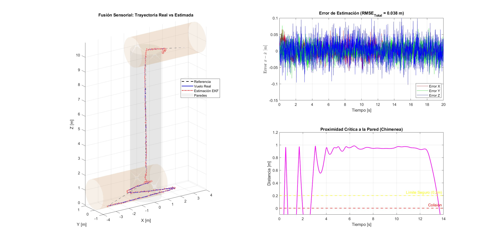

# UAV Autonomous Inspection in Underground Mining

MATLAB simulation environment for the autonomous navigation of a quadrotor UAV in GPS-denied confined spaces (mining ventilation chimneys). This project integrates nonlinear robust control and sensor fusion to counteract severe aerodynamic disturbances.

## Features
* **Dynamics:** 12-DoF nonlinear quadrotor model under confined aerodynamic disturbances (thermal wind gusts, wall-repulsion).
* **Control:** Sliding Mode Control (SMC) for highly robust trajectory tracking.
* **Estimation:** Extended Kalman Filter (EKF) fusing IMU kinematics with a simulated LiDAR-SLAM model.
* **Visualization:** 3D kinematic animation with real-time telemetry and error tracking.

## Repository Structure
* `/scripts`: Main executable simulations (`main_basic.m` -> PID baseline, `main_smc.m` -> Ideal SMC, `main_smc_perturbed.m` -> Robust EKF-SMC).
* `/controllers`: Feedback control laws (SMC, PD).
* `/models`: Plant dynamics, trajectory generation, and sensor models.

## Usage
Clone the repository and run `main_smc_perturbed.m` in MATLAB. The script executes the full sensor fusion loop and automatically generates the 3D animation.

## Results

*Watch the full 3D simulation video: [Simulacion_UAV_Chimenea.mp4](https://youtu.be/gUs7XQ5MSq8?si=8byVfwY2t0KUZZFE)*

## Author
**Kevin Jesú Antezana Livia**
Mechatronics Engineer | Control Systems & UAVs
